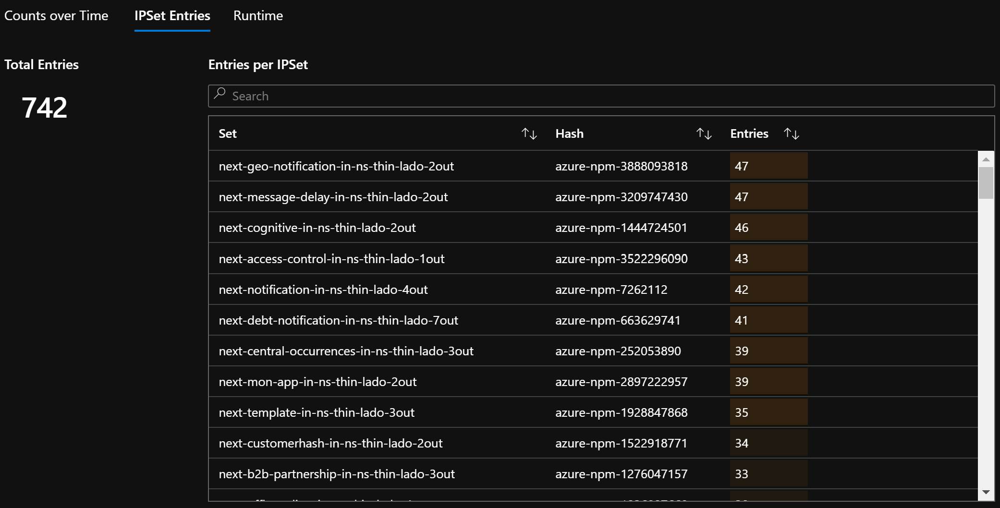
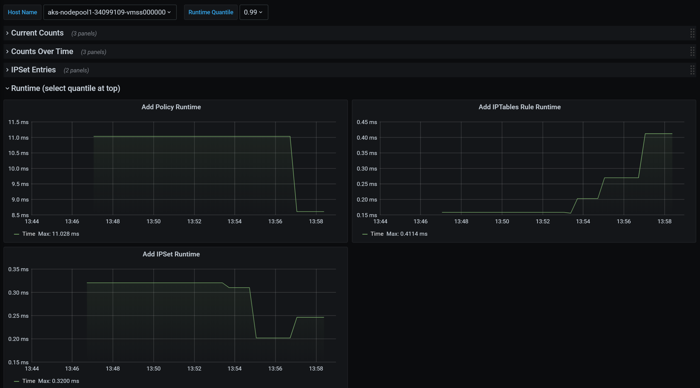

# Monitor and Visualize Network Configurations with Azure Network Policy Manager (NPM)
In your AKS cluster, it can be difficult to detect imperfections in your network policies or determine their impact on performance, especially as the number of policies increase. Azure Network Policy Manager (NPM) includes informative Prometheus metrics that allow you to monitor and better understand your configurations, especially using our out of the box visualizations in either the Azure Portal or Grafana Labs. You can quickly start collecting these metrics using either Azure Container Insights or a Prometheus Server depending on your current architecture needs or personal preferences. 

## Benefits of NPM Metrics
Users previously were only able to learn about their Network Configuration with the command `iptables -L` run inside a cluster node, which yields a verbose and difficult to understand output. For context, Network Policy Manager uses Linux IPTables to translate Kubernetes Network Policies into sets of allowed and disallowed IP pairs, which are grouped together using Linux IPSets. NPM's Prometheus metrics provide the following benefits related to Network Policies, IPTables Rules, and IPSets:
-	Summary information about overall configuration complexity
-	Policy, rule, and set counts over time, allowing insight into the relationship between the three and adding a dimension of time to debugging a configuration
-	Number of entries in all IPSets and each IPSet (OS sets a hard limit on number of entries)
-	Worst and average case performance per node for adding components to your Network Configuration

### Current Metrics
| Metric Name                       | Description                                    | Prometheus Metric Type | Labels         |
| --                                | --                                             | --       |  -                           |
| `npm_num_policies`                | number of network policies                     | Gauge    |  -                           |
| `npm_num_iptables_rules`          | number of IPTables rules                       | Gauge    |  -                           |
| `npm_num_ipsets`                  | number of IPSets                               | Gauge    |  -                           |
| `npm_num_ipset_entries`           | number of IP address entries in all IPSets     | Gauge    |  -                           |
| `npm_add_policy_exec_time`        | runtime for adding a network policy            | Summary  | quantile (0.5, 0.9, or 0.99) |
| `npm_add_iptables_rule_exec_time` | runtime for adding an IPTables rule            | Summary  | quantile (0.5, 0.9, or 0.99) |
| `npm_add_ipset_exec_time`         | runtime for adding an IPSet                    | Summary  | quantile (0.5, 0.9, or 0.99) |
| `npm_ipset_counts` (advanced)     | number of entries within each individual IPSet | GaugeVec | set name & hash              |

The different quantile levels in "exec_time" metrics help you differentiate between the general and worst case scenarios. 

There's also an "exec_time_count" and "exec_time_sum" metric for each "exec_time" Summary metric. For more information on Prometheus Summary metrics, read this [Prometheus article](prometheus-summary-docs). 

## Quick Setup for Container Insights
Once you have Container Insights enabled for your cluster, you can [configure Container Insights agents](CI-config) to collect NPM's Prometheus metrics by setting the following in the [container-azm-ms-agentconfig.yaml](agentconfig.yaml): 
```
basic-npm-metrics: true
advanced-npm-metrics: true 
```
and then running `kubectl apply -f container-azm-ms-agentconfig.yaml`.

Advanced metrics are optional, and turning them on will automatically turn basic metrics on. Advanced metrics currently include:
- `npm_ipset_counts`

### Visualization Options
With Container Insights, you can view your configuration in the Azure Portal or in Grafana.

#### Azure Tools
Open Azure Portal. Once in your cluster, navigate to "Workbooks" under the Insights section, and open "Network Policy Manager (NPM) Configuration".

Besides viewing the workbook (pictures below), you can also directly query the Prometheus metrics in "Logs" under the Insights section. For example, this query will return all the metrics being collected:
```
InsightsMetrics
| where Namespace == "prometheus"
| where TimeGenerated > ago(5h)
| where Name contains "npm_"
```

##### Azure Workbook Summary Counts


##### Azure Workbook Counts over Time


##### Azure Workbook IPSet Entries


##### Azure Workbook Runtime Quantiles


#### Grafana Dashboard
If you haven't already, set up your Grafana Server and configure a Log Analytics Data Source as described [here](CI-grafana-setup). Then, import our [Grafana Dashboard with a Log Analytics backend](CI-grafana-dashboard) into your Grafana Labs.

The dashboard has very similar visuals compared to the Azure Workbook. 

##### Grafana Dashboard Summary Counts


##### Grafana Dashboard Counts over Time


##### Grafana Dashboard IPSet Entries


##### Grafana Dashboard Runtime Quantiles


## Quick Setup for Prometheus Server
Some users may choose to collect metrics with a Prometheus Server instead of Azure's native Container Insights. You merely need to add two jobs to your scrape config to collect NPM metrics. 

To install a simple Prometheus Server, add this helm repo on your cluster 
```
helm repo add stable https://kubernetes-charts.storage.googleapis.com
helm repo update
```
then add a server
```
helm install prometheus stable/prometheus -n monitoring \
--set pushgateway.enabled=false,alertmanager.enabled=false, \
--set-file extraScrapeConfigs=prometheus-server-scrape-config.yaml
```
where `prometheus-server-scrape-config.yaml` consists of the following:
```
- job_name: "azure-npm-node-metrics"
  metrics_path: /node-metrics
  kubernetes_sd_configs:
  - role: node
  relabel_configs:
  - source_labels: [__address__]
    action: replace
    regex: ([^:]+)(?::\d+)?
    replacement: "$1:10091"
    target_label: __address__

- job_name: "azure-npm-cluster-metrics"
  metrics_path: /cluster-metrics
  kubernetes_sd_configs:
  - role: service
  relabel_configs:
  - source_labels: [__meta_kubernetes_namespace]
    regex: kube-system
    action: keep
  - source_labels: [__meta_kubernetes_service_name]
    regex: npm-metrics-cluster-service
    action: keep
# Comment from here to the end to collect advanced metrics: number of entries for each IPSet
  metric_relabel_configs:
  - source_labels: [__name__]
    regex: npm_ipset_counts
    action: drop
```

You can also replace the `azure-npm-node-metrics` job above with the following, or incorporate the following into a pre-existing job for Kubernetes pods:
```
- job_name: "azure-npm-node-metrics-from-pod-config"
  metrics_path: /node-metrics
  kubernetes_sd_configs:
  - role: pod
  relabel_configs:
  - source_labels: [__meta_kubernetes_namespace]
    regex: kube-system
    action: keep
  - source_labels: [__meta_kubernetes_pod_annotationpresent_azure_npm_scrapeable]
    action: keep
  - source_labels: [__address__]
    action: replace
    regex: ([^:]+)(?::\d+)?
    replacement: "$1:10091"
    target_label: __address__
```

### Visualization Options
There is only support for a Grafana Dashboard when using a Prometheus Server. 

If you haven't already, set up your Grafana Server and configure a Prometheus Data Source. Then, import our [Grafana Dashboard with a Prometheus backend](prometheus-grafana-dashboard) into your Grafana Labs.

The visuals for this dashboard are identical to the dashboard with a Container Insights/Log Analytics backend.

## Next steps
If you use Container Insights to collect NPM metrics, learn more about querying in Log Analytics with [Getting Started with Log Analytics Queries](log-analytics-queries).

<!-- LINKS - external -->
[agentconfig.yaml]: https://github.com/microsoft/OMS-docker/blob/ci_feature_prod/Kubernetes/container-azm-ms-agentconfig.yaml
[prometheus-summary-doc]: https://prometheus.io/docs/concepts/metric_types/#summary
[CI-grafana-dashboard]: https://grafana.com/grafana/dashboards/12180
[prometheus-grafana-dashboard]: https://grafana.com/grafana/dashboards/12180
 <!-- FIXME: both dashboards currently shows AKS dashboard -->

<!-- LINKS - internal -->
[CI-config]: /azure/azure-monitor/insights/container-insights-agent-config
[CI-grafana-setup]: /azure/azure-monitor/platform/grafana-plugin
[log-analytics-queries]: /azure-monitor/log-query/get-started-portal