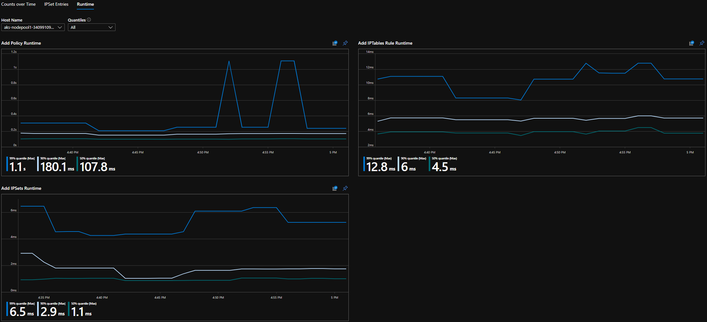
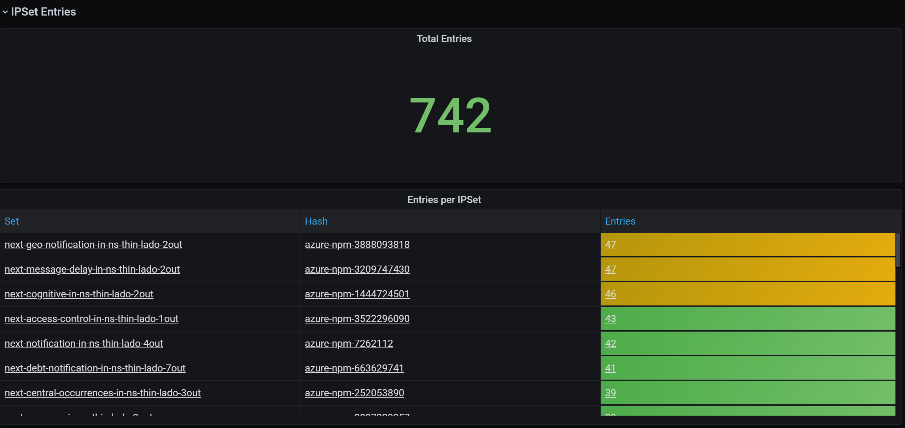

# Monitor and Visualize Network Configurations with Azure Network Policy Manager (NPM)
In your AKS cluster, it can be difficult to detect imperfections in your network policies or determine their impact on performance, especially as the number of policies increase. Azure Network Policy Manager (NPM) includes informative Prometheus metrics that allow you to better understand your configurations, especially using our out of the box visualizations in either the Azure Portal or Grafana Labs. You can quickly enable monitoring or visualization with Azure Container Insights or a Prometheus Server depending on your current architecture or personal preferences. 

## Benefits of Prometheus Metrics
Users used to only be able to learn about their Network Configuration with the command `iptables -L` run inside a cluster node, which yields a verbose and difficult to understand output. For context, NPM uses Linux IPTables to enforce Kubernetes Network Policies. Policies are translated into sets of allowed and disallowed IP pairs, which are grouped together using Linux IPSets. NPM's Prometheus metrics provide the following benefits related to Network Policies, IPTables Rules, and IPSets:
-	Summary info about your configuration complexity
-	Policy, rule, and set counts over time, allowing insight into the relationship between the three and adding a dimension of time to debugging
-	Number of entries in all IPSets and each IPSet (OS sets a hard limit on number of entries)
-	Worst and average case performance at node granularity for adding components to your Network Configuration

## Quick Setup for Container Insights
Once you have Container Insights enabled for your cluster, you can [configure Container Insights agents](CI-config) to collect NPM's Prometheus metrics by setting the following in the [container-azm-ms-agentconfig.yaml](agentconfig.yaml): 
```
basic-npm-metrics: true
advanced-npm-metrics: true 
```

Advanced metrics are optional, and turning them on will automatically turn basic metrics on. Advanced metrics include:
- number of entries in any given IPSet

### Visualization Options
With Container Insights, you can view your configuration in Azure Workbooks or in a Grafana Dashboard. 

#### Azure Workbook
Open Azure Portal, and once in your cluster, navigate to "Workbooks" under the Insights section, and open "Network Policy Manager Configuration".
 


You can also query NPM Prometheus metrics in the "Logs" section. For example, this query will return all the metrics being collected:
```
InsightsMetrics
| where Namespace == "prometheus"
| where TimeGenerated > ago(5h)
| where Name contains "npm_"
```

##### Azure Workbook Summary Counts


##### Azure Workbook Counts over Time


##### Azure Workbook IPSet Entries


##### Azure Workbook Runtime Quantiles


#### Grafana Dashboard
If you haven't already, set up your Grafana Server and configure a Log Analytics Data Source as described [here](CI-grafana-setup). Then, import our [Grafana Dashboard with a Log Analytics backend](CI-grafana-dashboard) into your Grafana Labs.

The dashboard has very similar visuals compared to the Azure Workbook. 

##### Grafana Dashboard Summary Counts


##### Grafana Dashboard Counts over Time


##### Grafana Dashboard IPSet Entries


##### Grafana Dashboard Runtime Quantiles


## Quick Setup for Prometheus Server
Some users may choose to collect metrics with a Prometheus Server instead of Azure's native Container Insights. When configuring your Prometheus Server, include these two jobs: 
```
TODO
```

If you'd like to include the advanced metrics as described above in Quick Setup for Container Insights, then delete this rule from the configuration above: 
```
TODO
```

### Visualization Options
There is only support for a Grafana Dashboard when using a Prometheus Server. 

If you haven't already, set up your Grafana Server and configure a Prometheus Data Source. Then, import our [Grafana Dashboard with a Prometheus backend](prometheus-grafana-dashboard) into your Grafana Labs.

The visuals for this dashboard are identical to the dashboard with a Container Insights/Log Analytics backend.

## Next steps
If you choose the Container Insights solution, for more about querying in Log Analytics, see [Getting Started with Log Analytics Queries](log-analytics-queries).

<!-- LINKS - external -->
[agentconfig.yaml]: https://github.com/microsoft/OMS-docker/blob/ci_feature_prod/Kubernetes/container-azm-ms-agentconfig.yaml
[CI-grafana-dashboard]: https://grafana.com/grafana/dashboards/12180
[prometheus-grafana-dashboard]: https://grafana.com/grafana/dashboards/12180
 <!-- FIXME: both dashboards currently shows AKS dashboard -->

<!-- LINKS - internal -->
[CI-config]: /azure/azure-monitor/insights/container-insights-agent-config
[CI-grafana-setup]: /azure/azure-monitor/platform/grafana-plugin
[log-analytics-queries]: /azure-monitor/log-query/get-started-portal